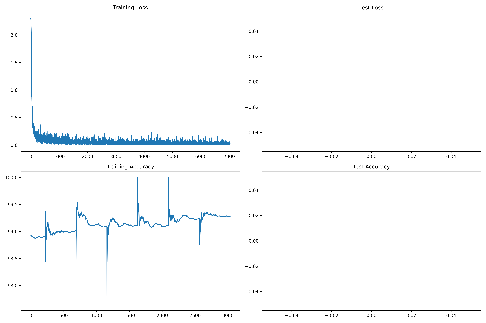
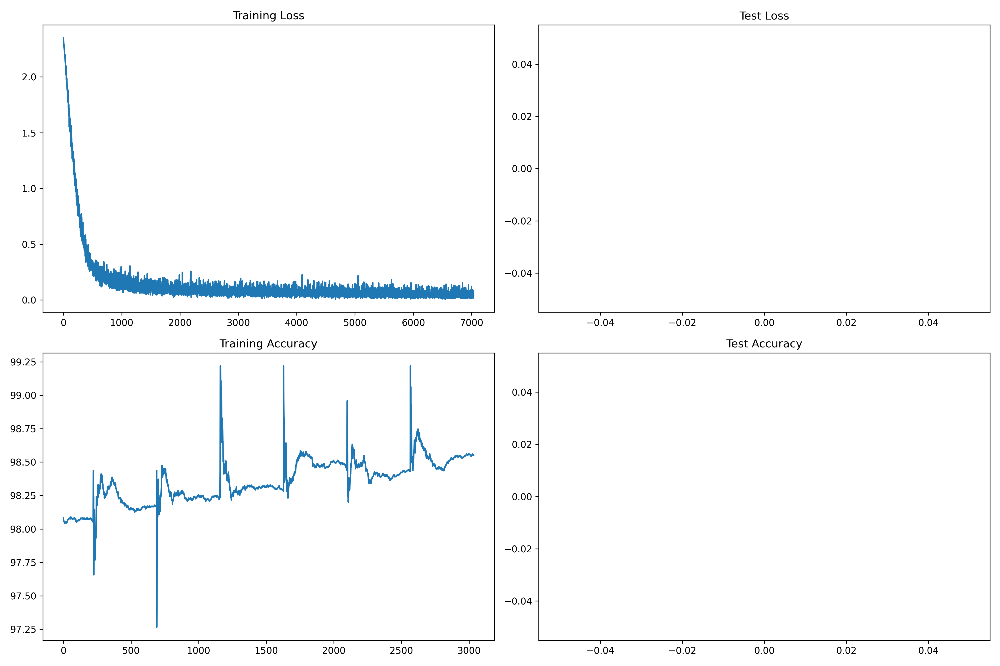
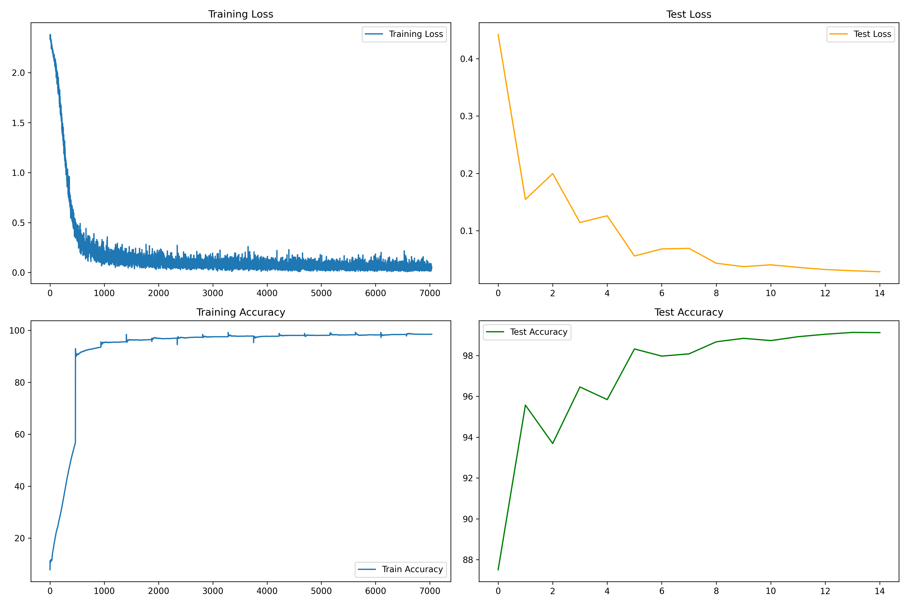

# Model - 1
## Traget:
1. Prepare a skeleton code. Set epochs=15.
2. Prepare a stable model where there is no inherent over fitting.

## Results:
1. Parameters: 18,422
2. Best Training Accuracy: 99.15%
3. Best Testing Accuracy: 99.17%

## Analysis:
1. Model is consistently improving the learning.
2. Accuracy is above 99%
3. There is an opportunity to bring down the parameters to 8000.

## 1. Model_1.py logs:
```
(.venv) PS C:\Raghu\MyLearnings\ERA_V4\S6-21092025\code\mnist_digits_experiments> python .\Experiment1.py
CUDA Available? True
cuda
----------------------------------------------------------------
        Layer (type)               Output Shape         Param #
================================================================
            Conv2d-1            [-1, 8, 28, 28]              80
       BatchNorm2d-2            [-1, 8, 28, 28]              16
         MaxPool2d-3            [-1, 8, 14, 14]               0
            Conv2d-4           [-1, 16, 14, 14]           1,168
       BatchNorm2d-5           [-1, 16, 14, 14]              32
         MaxPool2d-6             [-1, 16, 7, 7]               0
            Conv2d-7              [-1, 8, 7, 7]             136
            Conv2d-8             [-1, 32, 7, 7]           2,336
            Conv2d-9             [-1, 28, 7, 7]             924
           Linear-10                   [-1, 10]          13,730
================================================================
Total params: 18,422
Trainable params: 18,422
Non-trainable params: 0
----------------------------------------------------------------
Input size (MB): 0.00
Forward/backward pass size (MB): 0.19
Params size (MB): 0.07
Estimated Total Size (MB): 0.26
----------------------------------------------------------------
EPOCH: 1
28092025-1439
Loss=0.09395576268434525 Batch_id=468 Accuracy=90.50: 100%|█████████████████████████████████████████████████████████████████████████████████████████████████████████████████████████████| 469/469 [00:32<00:00, 14.52it/s] 
28092025-1439

Test set: Average loss: 0.1156, Accuracy: 9621/10000 (96.21%)

C:\Raghu\MyLearnings\ERA_V4\S6-21092025\code\mnist_digits_experiments\.venv\Lib\site-packages\torch\optim\lr_scheduler.py:240: UserWarning: The epoch parameter in `scheduler.step()` was not necessary and is being deprecated where possible. Please use `scheduler.step()` to step the scheduler. During the deprecation, if epoch is different from None, the closed form is used instead of the new chainable form, where available. Please open an issue if you are unable to replicate your use case: https://github.com/pytorch/pytorch/issues/new/choose.
  warnings.warn(EPOCH_DEPRECATION_WARNING, UserWarning)
-----------------------------------------------
EPOCH: 2
28092025-1439
Loss=0.09951924532651901 Batch_id=468 Accuracy=97.21: 100%|█████████████████████████████████████████████████████████████████████████████████████████████████████████████████████████████| 469/469 [00:36<00:00, 12.77it/s] 
28092025-1440

Test set: Average loss: 0.0483, Accuracy: 9845/10000 (98.45%)

-----------------------------------------------
EPOCH: 3
28092025-1440
Loss=0.02210957370698452 Batch_id=468 Accuracy=97.92: 100%|█████████████████████████████████████████████████████████████████████████████████████████████████████████████████████████████| 469/469 [00:36<00:00, 12.89it/s] 
28092025-1441

Test set: Average loss: 0.0381, Accuracy: 9875/10000 (98.75%)

-----------------------------------------------
EPOCH: 4
28092025-1441
Loss=0.062317878007888794 Batch_id=468 Accuracy=98.27: 100%|████████████████████████████████████████████████████████████████████████████████████████████████████████████████████████████| 469/469 [00:42<00:00, 11.08it/s] 
28092025-1441

Test set: Average loss: 0.0412, Accuracy: 9862/10000 (98.62%)

-----------------------------------------------
EPOCH: 5
28092025-1441
Loss=0.01374585647135973 Batch_id=468 Accuracy=98.54: 100%|█████████████████████████████████████████████████████████████████████████████████████████████████████████████████████████████| 469/469 [00:46<00:00, 10.19it/s] 
28092025-1442

Test set: Average loss: 0.0491, Accuracy: 9835/10000 (98.35%)

-----------------------------------------------
EPOCH: 6
28092025-1442
Loss=0.04199260100722313 Batch_id=468 Accuracy=98.67: 100%|█████████████████████████████████████████████████████████████████████████████████████████████████████████████████████████████| 469/469 [00:52<00:00,  8.88it/s] 
28092025-1443

Test set: Average loss: 0.0387, Accuracy: 9873/10000 (98.73%)

-----------------------------------------------
EPOCH: 7
28092025-1443
Loss=0.021661289036273956 Batch_id=468 Accuracy=98.78: 100%|████████████████████████████████████████████████████████████████████████████████████████████████████████████████████████████| 469/469 [00:58<00:00,  7.99it/s] 
28092025-1444

Test set: Average loss: 0.0298, Accuracy: 9894/10000 (98.94%)

-----------------------------------------------
EPOCH: 8
28092025-1444
Loss=0.032435160130262375 Batch_id=468 Accuracy=98.90: 100%|████████████████████████████████████████████████████████████████████████████████████████████████████████████████████████████| 469/469 [00:53<00:00,  8.77it/s] 
28092025-1445

Test set: Average loss: 0.0358, Accuracy: 9887/10000 (98.87%)

-----------------------------------------------
EPOCH: 9
28092025-1445
Loss=0.02156253717839718 Batch_id=468 Accuracy=98.92: 100%|█████████████████████████████████████████████████████████████████████████████████████████████████████████████████████████████| 469/469 [00:53<00:00,  8.69it/s] 
28092025-1446

Test set: Average loss: 0.0249, Accuracy: 9911/10000 (99.11%)

-----------------------------------------------
EPOCH: 10
28092025-1446
Loss=0.03644905239343643 Batch_id=468 Accuracy=99.00: 100%|█████████████████████████████████████████████████████████████████████████████████████████████████████████████████████████████| 469/469 [00:56<00:00,  8.31it/s] 
28092025-1447

Test set: Average loss: 0.0314, Accuracy: 9902/10000 (99.02%)

-----------------------------------------------
EPOCH: 11
28092025-1447
Loss=0.009006721898913383 Batch_id=468 Accuracy=99.10: 100%|████████████████████████████████████████████████████████████████████████████████████████████████████████████████████████████| 469/469 [01:20<00:00,  5.85it/s] 
28092025-1449

Test set: Average loss: 0.0279, Accuracy: 9905/10000 (99.05%)

-----------------------------------------------
EPOCH: 12
28092025-1449
Loss=0.002540260786190629 Batch_id=468 Accuracy=99.11: 100%|████████████████████████████████████████████████████████████████████████████████████████████████████████████████████████████| 469/469 [01:04<00:00,  7.25it/s] 
28092025-1450

Test set: Average loss: 0.0267, Accuracy: 9912/10000 (99.12%)

-----------------------------------------------
EPOCH: 13
28092025-1450
Loss=0.008956954814493656 Batch_id=468 Accuracy=99.11: 100%|████████████████████████████████████████████████████████████████████████████████████████████████████████████████████████████| 469/469 [01:04<00:00,  7.30it/s] 
28092025-1451

Test set: Average loss: 0.0268, Accuracy: 9905/10000 (99.05%)

-----------------------------------------------
EPOCH: 14
28092025-1451
Loss=0.02956872247159481 Batch_id=468 Accuracy=99.24: 100%|█████████████████████████████████████████████████████████████████████████████████████████████████████████████████████████████| 469/469 [01:00<00:00,  7.81it/s] 
28092025-1452

Test set: Average loss: 0.0309, Accuracy: 9904/10000 (99.04%)

-----------------------------------------------
EPOCH: 15
28092025-1452
Loss=0.03176385536789894 Batch_id=468 Accuracy=99.28: 100%|█████████████████████████████████████████████████████████████████████████████████████████████████████████████████████████████| 469/469 [00:44<00:00, 10.48it/s] 
28092025-1453

Test set: Average loss: 0.0265, Accuracy: 9916/10000 (99.16%)

-----------------------------------------------
Plot saved as training_results-28092025-1453.png
(.venv) PS C:\Raghu\MyLearnings\ERA_V4\S6-21092025\code\mnist_digits_experiments> 
```
### Model-1 Performance:



# Model - 2
## Traget:
1. Aim to bring down the parameters to 8K. 
2. Remove FC
3. Use GAP
4. change optimizer to SGD

## Results:
1. Parameters: 8,682
2. Best Training Accuracy: 99.25%
3. Best Testing Accuracy: 99.36%

## Analysis:
1. Slightly overfitting model
2. Accuracy dropped below 99%
3. Start improving the Learning to achieve 99.4%


```
(.venv) PS C:\Raghu\MyLearnings\ERA_V4\S6-21092025\code\mnist_digits_experiments> python .\Experiment3.py
CUDA Available? True
cuda
----------------------------------------------------------------
        Layer (type)               Output Shape         Param #
================================================================
            Conv2d-1            [-1, 8, 28, 28]              80
       BatchNorm2d-2            [-1, 8, 28, 28]              16
            Conv2d-3           [-1, 16, 28, 28]           1,168
       BatchNorm2d-4           [-1, 16, 28, 28]              32
         MaxPool2d-5           [-1, 16, 14, 14]               0
            Conv2d-6           [-1, 16, 14, 14]           2,320
       BatchNorm2d-7           [-1, 16, 14, 14]              32
         MaxPool2d-8             [-1, 16, 7, 7]               0
            Conv2d-9             [-1, 28, 7, 7]           4,060
      BatchNorm2d-10             [-1, 28, 7, 7]              56
           Conv2d-11             [-1, 10, 7, 7]             290
AdaptiveAvgPool2d-12             [-1, 10, 1, 1]               0
================================================================
Total params: 8,054
Trainable params: 8,054
Non-trainable params: 0
----------------------------------------------------------------
Input size (MB): 0.00
Forward/backward pass size (MB): 0.39
Params size (MB): 0.03
Estimated Total Size (MB): 0.42
----------------------------------------------------------------
EPOCH: 1
28092025-1351
Epoch 1 Loss=0.5005 Batch_id=468 Accuracy=56.71: 100%|██████████████████████████████████████████████████████████████████████████████████████████████████████████████████████████████████| 469/469 [00:34<00:00, 13.64it/s] 
28092025-1352

Test set: Average loss: 0.4422, Accuracy: 8751/10000 (87.51%)

-----------------------------------------------
EPOCH: 2
28092025-1352
Epoch 2 Loss=0.1320 Batch_id=468 Accuracy=93.54: 100%|██████████████████████████████████████████████████████████████████████████████████████████████████████████████████████████████████| 469/469 [00:34<00:00, 13.78it/s] 
28092025-1353

Test set: Average loss: 0.1546, Accuracy: 9557/10000 (95.57%)

-----------------------------------------------
EPOCH: 3
28092025-1353
Epoch 3 Loss=0.2393 Batch_id=468 Accuracy=95.60: 100%|██████████████████████████████████████████████████████████████████████████████████████████████████████████████████████████████████| 469/469 [00:34<00:00, 13.41it/s] 
28092025-1353

Test set: Average loss: 0.1997, Accuracy: 9369/10000 (93.69%)

-----------------------------------------------
EPOCH: 4
28092025-1353
Epoch 4 Loss=0.1130 Batch_id=468 Accuracy=96.46: 100%|██████████████████████████████████████████████████████████████████████████████████████████████████████████████████████████████████| 469/469 [00:35<00:00, 13.35it/s] 
28092025-1354

Test set: Average loss: 0.1144, Accuracy: 9646/10000 (96.46%)

-----------------------------------------------
EPOCH: 5
28092025-1354
Epoch 5 Loss=0.2724 Batch_id=468 Accuracy=97.02: 100%|██████████████████████████████████████████████████████████████████████████████████████████████████████████████████████████████████| 469/469 [00:35<00:00, 13.40it/s] 
28092025-1355

Test set: Average loss: 0.1261, Accuracy: 9584/10000 (95.84%)

-----------------------------------------------
EPOCH: 6
28092025-1355
Epoch 6 Loss=0.0905 Batch_id=468 Accuracy=97.37: 100%|██████████████████████████████████████████████████████████████████████████████████████████████████████████████████████████████████| 469/469 [00:35<00:00, 13.25it/s] 
28092025-1355

Test set: Average loss: 0.0560, Accuracy: 9832/10000 (98.32%)

-----------------------------------------------
EPOCH: 7
28092025-1355
Epoch 7 Loss=0.0367 Batch_id=468 Accuracy=97.57: 100%|██████████████████████████████████████████████████████████████████████████████████████████████████████████████████████████████████| 469/469 [00:34<00:00, 13.59it/s] 
28092025-1356

Test set: Average loss: 0.0683, Accuracy: 9797/10000 (97.97%)

-----------------------------------------------
EPOCH: 8
28092025-1356
Epoch 8 Loss=0.0696 Batch_id=468 Accuracy=97.83: 100%|██████████████████████████████████████████████████████████████████████████████████████████████████████████████████████████████████| 469/469 [00:35<00:00, 13.26it/s] 
28092025-1356

Test set: Average loss: 0.0694, Accuracy: 9808/10000 (98.08%)

-----------------------------------------------
EPOCH: 9
28092025-1357
Epoch 9 Loss=0.0344 Batch_id=468 Accuracy=97.78: 100%|██████████████████████████████████████████████████████████████████████████████████████████████████████████████████████████████████| 469/469 [00:35<00:00, 13.08it/s] 
28092025-1357

Test set: Average loss: 0.0434, Accuracy: 9867/10000 (98.67%)

-----------------------------------------------
EPOCH: 10
28092025-1357
Epoch 10 Loss=0.0485 Batch_id=468 Accuracy=98.04: 100%|█████████████████████████████████████████████████████████████████████████████████████████████████████████████████████████████████| 469/469 [00:36<00:00, 12.99it/s] 
28092025-1358

Test set: Average loss: 0.0374, Accuracy: 9884/10000 (98.84%)

-----------------------------------------------
EPOCH: 11
28092025-1358
Epoch 11 Loss=0.0298 Batch_id=468 Accuracy=98.12: 100%|█████████████████████████████████████████████████████████████████████████████████████████████████████████████████████████████████| 469/469 [00:37<00:00, 12.56it/s] 
28092025-1358

Test set: Average loss: 0.0406, Accuracy: 9873/10000 (98.73%)

-----------------------------------------------
EPOCH: 12
28092025-1358
Epoch 12 Loss=0.0411 Batch_id=468 Accuracy=98.29: 100%|█████████████████████████████████████████████████████████████████████████████████████████████████████████████████████████████████| 469/469 [00:38<00:00, 12.32it/s] 
28092025-1359

Test set: Average loss: 0.0362, Accuracy: 9892/10000 (98.92%)

-----------------------------------------------
EPOCH: 13
28092025-1359
Epoch 13 Loss=0.0907 Batch_id=468 Accuracy=98.26: 100%|█████████████████████████████████████████████████████████████████████████████████████████████████████████████████████████████████| 469/469 [00:40<00:00, 11.47it/s] 
28092025-1400

Test set: Average loss: 0.0324, Accuracy: 9904/10000 (99.04%)

-----------------------------------------------
EPOCH: 14
28092025-1400
Epoch 14 Loss=0.1292 Batch_id=468 Accuracy=98.39: 100%|█████████████████████████████████████████████████████████████████████████████████████████████████████████████████████████████████| 469/469 [00:41<00:00, 11.28it/s] 
28092025-1401

Test set: Average loss: 0.0303, Accuracy: 9913/10000 (99.13%)

-----------------------------------------------
EPOCH: 15
28092025-1401
Epoch 15 Loss=0.0495 Batch_id=468 Accuracy=98.53: 100%|█████████████████████████████████████████████████████████████████████████████████████████████████████████████████████████████████| 469/469 [00:41<00:00, 11.18it/s] 
28092025-1401

Test set: Average loss: 0.0285, Accuracy: 9912/10000 (99.12%)

-----------------------------------------------
Plot saved as training_results-28092025-1401.png
(.venv) PS C:\Raghu\MyLearnings\ERA_V4\S6-21092025\code\mnist_digits_experiments> ^C
(.venv) PS C:\Raghu\MyLearnings\ERA_V4\S6-21092025\code\mnist_digits_experiments> python .\Experiment2.py
CUDA Available? True
cuda
----------------------------------------------------------------
        Layer (type)               Output Shape         Param #
================================================================
            Conv2d-1            [-1, 8, 28, 28]              80
       BatchNorm2d-2            [-1, 8, 28, 28]              16
            Conv2d-3           [-1, 16, 28, 28]           1,168
       BatchNorm2d-4           [-1, 16, 28, 28]              32
         MaxPool2d-5           [-1, 16, 14, 14]               0
            Conv2d-6           [-1, 16, 14, 14]           2,320
       BatchNorm2d-7           [-1, 16, 14, 14]              32
         MaxPool2d-8             [-1, 16, 7, 7]               0
            Conv2d-9             [-1, 32, 7, 7]           4,640
      BatchNorm2d-10             [-1, 32, 7, 7]              64
           Conv2d-11             [-1, 10, 7, 7]             330
AdaptiveAvgPool2d-12             [-1, 10, 1, 1]               0
================================================================
Total params: 8,682
Trainable params: 8,682
Non-trainable params: 0
----------------------------------------------------------------
Input size (MB): 0.00
Forward/backward pass size (MB): 0.39
Params size (MB): 0.03
Estimated Total Size (MB): 0.43
----------------------------------------------------------------
EPOCH: 1
28092025-1423
Loss=0.36920347809791565 Batch_id=468 Accuracy=71.10: 100%|█████████████████████████████████████████████████████████████████████████████████████████████████████████████████████████████| 469/469 [00:27<00:00, 17.35it/s]
28092025-1424

Test set: Average loss: 0.4277, Accuracy: 8900/10000 (89.00%)

C:\Raghu\MyLearnings\ERA_V4\S6-21092025\code\mnist_digits_experiments\.venv\Lib\site-packages\torch\optim\lr_scheduler.py:240: UserWarning: The epoch parameter in `scheduler.step()` was not necessary and is being deprecated where possible. Please use `scheduler.step()` to step the scheduler. During the deprecation, if epoch is different from None, the closed form is used instead of the new chainable form, where available. Please open an issue if you are unable to replicate your use case: https://github.com/pytorch/pytorch/issues/new/choose.
  warnings.warn(EPOCH_DEPRECATION_WARNING, UserWarning)
-----------------------------------------------
EPOCH: 2
28092025-1424
Loss=0.15809984505176544 Batch_id=468 Accuracy=95.14: 100%|█████████████████████████████████████████████████████████████████████████████████████████████████████████████████████████████| 469/469 [00:28<00:00, 16.58it/s] 
28092025-1424

Test set: Average loss: 0.1636, Accuracy: 9553/10000 (95.53%)

-----------------------------------------------
EPOCH: 3
28092025-1424
Loss=0.10418612509965897 Batch_id=468 Accuracy=96.42: 100%|█████████████████████████████████████████████████████████████████████████████████████████████████████████████████████████████| 469/469 [00:29<00:00, 15.97it/s] 
28092025-1425

Test set: Average loss: 0.0978, Accuracy: 9710/10000 (97.10%)

-----------------------------------------------
EPOCH: 4
28092025-1425
Loss=0.10030681639909744 Batch_id=468 Accuracy=97.03: 100%|█████████████████████████████████████████████████████████████████████████████████████████████████████████████████████████████| 469/469 [00:30<00:00, 15.14it/s] 
28092025-1425

Test set: Average loss: 0.0975, Accuracy: 9723/10000 (97.23%)

-----------------------------------------------
EPOCH: 5
28092025-1425
Loss=0.17494289577007294 Batch_id=468 Accuracy=97.43: 100%|█████████████████████████████████████████████████████████████████████████████████████████████████████████████████████████████| 469/469 [00:32<00:00, 14.38it/s] 
28092025-1426

Test set: Average loss: 0.0895, Accuracy: 9739/10000 (97.39%)

-----------------------------------------------
EPOCH: 6
28092025-1426
Loss=0.07066521048545837 Batch_id=468 Accuracy=97.53: 100%|█████████████████████████████████████████████████████████████████████████████████████████████████████████████████████████████| 469/469 [00:33<00:00, 13.97it/s] 
28092025-1426

Test set: Average loss: 0.0812, Accuracy: 9754/10000 (97.54%)

-----------------------------------------------
EPOCH: 7
28092025-1427
Loss=0.06886536628007889 Batch_id=468 Accuracy=97.81: 100%|█████████████████████████████████████████████████████████████████████████████████████████████████████████████████████████████| 469/469 [00:33<00:00, 13.86it/s] 
28092025-1427

Test set: Average loss: 0.0742, Accuracy: 9769/10000 (97.69%)

-----------------------------------------------
EPOCH: 8
28092025-1427
Loss=0.10225506871938705 Batch_id=468 Accuracy=97.97: 100%|█████████████████████████████████████████████████████████████████████████████████████████████████████████████████████████████| 469/469 [00:34<00:00, 13.63it/s] 
28092025-1428

Test set: Average loss: 0.0845, Accuracy: 9750/10000 (97.50%)

-----------------------------------------------
EPOCH: 9
28092025-1428
Loss=0.13639578223228455 Batch_id=468 Accuracy=98.05: 100%|█████████████████████████████████████████████████████████████████████████████████████████████████████████████████████████████| 469/469 [00:35<00:00, 13.39it/s] 
28092025-1428

Test set: Average loss: 0.0700, Accuracy: 9793/10000 (97.93%)

-----------------------------------------------
EPOCH: 10
28092025-1428
Loss=0.04578019306063652 Batch_id=468 Accuracy=98.17: 100%|█████████████████████████████████████████████████████████████████████████████████████████████████████████████████████████████| 469/469 [00:35<00:00, 13.20it/s] 
28092025-1429

Test set: Average loss: 0.0671, Accuracy: 9808/10000 (98.08%)

-----------------------------------------------
EPOCH: 11
28092025-1429
Loss=0.05619727075099945 Batch_id=468 Accuracy=98.23: 100%|█████████████████████████████████████████████████████████████████████████████████████████████████████████████████████████████| 469/469 [00:36<00:00, 12.93it/s] 
28092025-1430

Test set: Average loss: 0.0511, Accuracy: 9845/10000 (98.45%)

-----------------------------------------------
EPOCH: 12
28092025-1430
Loss=0.1221398189663887 Batch_id=468 Accuracy=98.28: 100%|██████████████████████████████████████████████████████████████████████████████████████████████████████████████████████████████| 469/469 [00:36<00:00, 12.80it/s] 
28092025-1430

Test set: Average loss: 0.0513, Accuracy: 9840/10000 (98.40%)

-----------------------------------------------
EPOCH: 13
28092025-1430
Loss=0.028884632512927055 Batch_id=468 Accuracy=98.46: 100%|████████████████████████████████████████████████████████████████████████████████████████████████████████████████████████████| 469/469 [00:37<00:00, 12.46it/s] 
28092025-1431

Test set: Average loss: 0.0604, Accuracy: 9810/10000 (98.10%)

-----------------------------------------------
EPOCH: 14
28092025-1431
Loss=0.044170115143060684 Batch_id=468 Accuracy=98.43: 100%|████████████████████████████████████████████████████████████████████████████████████████████████████████████████████████████| 469/469 [00:37<00:00, 12.53it/s] 
28092025-1432

Test set: Average loss: 0.0693, Accuracy: 9784/10000 (97.84%)

-----------------------------------------------
EPOCH: 15
28092025-1432
Loss=0.0428624302148819 Batch_id=468 Accuracy=98.55: 100%|██████████████████████████████████████████████████████████████████████████████████████████████████████████████████████████████| 469/469 [00:40<00:00, 11.60it/s] 
28092025-1432

Test set: Average loss: 0.0419, Accuracy: 9870/10000 (98.70%)

-----------------------------------------------
Plot saved as training_results-28092025-1433.png
(.venv) PS C:\Raghu\MyLearnings\ERA_V4\S6-21092025\code\mnist_digits_experiments> 
```


### Model-2 Performance:


----------------------------------------------------------------


(.venv) PS C:\Raghu\MyLearnings\ERA_V4\S6-21092025\code\mnist_digits_experiments> python .\Experiment3.py
CUDA Available? True
cuda
----------------------------------------------------------------
        Layer (type)               Output Shape         Param #
================================================================
            Conv2d-1            [-1, 8, 28, 28]              80
       BatchNorm2d-2            [-1, 8, 28, 28]              16
            Conv2d-3           [-1, 16, 28, 28]           1,168
       BatchNorm2d-4           [-1, 16, 28, 28]              32
         MaxPool2d-5           [-1, 16, 14, 14]               0
            Conv2d-6           [-1, 16, 14, 14]           2,320
       BatchNorm2d-7           [-1, 16, 14, 14]              32
         MaxPool2d-8             [-1, 16, 7, 7]               0
            Conv2d-9             [-1, 28, 7, 7]           4,060
      BatchNorm2d-10             [-1, 28, 7, 7]              56
           Conv2d-11             [-1, 10, 7, 7]             290
AdaptiveAvgPool2d-12             [-1, 10, 1, 1]               0
================================================================
Total params: 8,054
Trainable params: 8,054
Non-trainable params: 0
----------------------------------------------------------------
Input size (MB): 0.00
Forward/backward pass size (MB): 0.39
Params size (MB): 0.03
Estimated Total Size (MB): 0.42
----------------------------------------------------------------
EPOCH: 1
28092025-1351
Epoch 1 Loss=0.5005 Batch_id=468 Accuracy=56.71: 100%|██████████████████████████████████████████████████████████████████████████████████████████████████████████████████████████████████| 469/469 [00:34<00:00, 13.64it/s] 
28092025-1352

Test set: Average loss: 0.4422, Accuracy: 8751/10000 (87.51%)

-----------------------------------------------
EPOCH: 2
28092025-1352
Epoch 2 Loss=0.1320 Batch_id=468 Accuracy=93.54: 100%|██████████████████████████████████████████████████████████████████████████████████████████████████████████████████████████████████| 469/469 [00:34<00:00, 13.78it/s] 
28092025-1353

Test set: Average loss: 0.1546, Accuracy: 9557/10000 (95.57%)

-----------------------------------------------
EPOCH: 3
28092025-1353
Epoch 3 Loss=0.2393 Batch_id=468 Accuracy=95.60: 100%|██████████████████████████████████████████████████████████████████████████████████████████████████████████████████████████████████| 469/469 [00:34<00:00, 13.41it/s] 
28092025-1353

Test set: Average loss: 0.1997, Accuracy: 9369/10000 (93.69%)

-----------------------------------------------
EPOCH: 4
28092025-1353
Epoch 4 Loss=0.1130 Batch_id=468 Accuracy=96.46: 100%|██████████████████████████████████████████████████████████████████████████████████████████████████████████████████████████████████| 469/469 [00:35<00:00, 13.35it/s] 
28092025-1354

Test set: Average loss: 0.1144, Accuracy: 9646/10000 (96.46%)

-----------------------------------------------
EPOCH: 5
28092025-1354
Epoch 5 Loss=0.2724 Batch_id=468 Accuracy=97.02: 100%|██████████████████████████████████████████████████████████████████████████████████████████████████████████████████████████████████| 469/469 [00:35<00:00, 13.40it/s] 
28092025-1355

Test set: Average loss: 0.1261, Accuracy: 9584/10000 (95.84%)

-----------------------------------------------
EPOCH: 6
28092025-1355
Epoch 6 Loss=0.0905 Batch_id=468 Accuracy=97.37: 100%|██████████████████████████████████████████████████████████████████████████████████████████████████████████████████████████████████| 469/469 [00:35<00:00, 13.25it/s] 
28092025-1355

Test set: Average loss: 0.0560, Accuracy: 9832/10000 (98.32%)

-----------------------------------------------
EPOCH: 7
28092025-1355
Epoch 7 Loss=0.0367 Batch_id=468 Accuracy=97.57: 100%|██████████████████████████████████████████████████████████████████████████████████████████████████████████████████████████████████| 469/469 [00:34<00:00, 13.59it/s] 
28092025-1356

Test set: Average loss: 0.0683, Accuracy: 9797/10000 (97.97%)

-----------------------------------------------
EPOCH: 8
28092025-1356
Epoch 8 Loss=0.0696 Batch_id=468 Accuracy=97.83: 100%|██████████████████████████████████████████████████████████████████████████████████████████████████████████████████████████████████| 469/469 [00:35<00:00, 13.26it/s] 
28092025-1356

Test set: Average loss: 0.0694, Accuracy: 9808/10000 (98.08%)

-----------------------------------------------
EPOCH: 9
28092025-1357
Epoch 9 Loss=0.0344 Batch_id=468 Accuracy=97.78: 100%|██████████████████████████████████████████████████████████████████████████████████████████████████████████████████████████████████| 469/469 [00:35<00:00, 13.08it/s] 
28092025-1357

Test set: Average loss: 0.0434, Accuracy: 9867/10000 (98.67%)

-----------------------------------------------
EPOCH: 10
28092025-1357
Epoch 10 Loss=0.0485 Batch_id=468 Accuracy=98.04: 100%|█████████████████████████████████████████████████████████████████████████████████████████████████████████████████████████████████| 469/469 [00:36<00:00, 12.99it/s] 
28092025-1358

Test set: Average loss: 0.0374, Accuracy: 9884/10000 (98.84%)

-----------------------------------------------
EPOCH: 11
28092025-1358
Epoch 11 Loss=0.0298 Batch_id=468 Accuracy=98.12: 100%|█████████████████████████████████████████████████████████████████████████████████████████████████████████████████████████████████| 469/469 [00:37<00:00, 12.56it/s] 
28092025-1358

Test set: Average loss: 0.0406, Accuracy: 9873/10000 (98.73%)

-----------------------------------------------
EPOCH: 12
28092025-1358
Epoch 12 Loss=0.0411 Batch_id=468 Accuracy=98.29: 100%|█████████████████████████████████████████████████████████████████████████████████████████████████████████████████████████████████| 469/469 [00:38<00:00, 12.32it/s] 
28092025-1359

Test set: Average loss: 0.0362, Accuracy: 9892/10000 (98.92%)

-----------------------------------------------
EPOCH: 13
28092025-1359
Epoch 13 Loss=0.0907 Batch_id=468 Accuracy=98.26: 100%|█████████████████████████████████████████████████████████████████████████████████████████████████████████████████████████████████| 469/469 [00:40<00:00, 11.47it/s] 
28092025-1400

Test set: Average loss: 0.0324, Accuracy: 9904/10000 (99.04%)

-----------------------------------------------
EPOCH: 14
28092025-1400
Epoch 14 Loss=0.1292 Batch_id=468 Accuracy=98.39: 100%|█████████████████████████████████████████████████████████████████████████████████████████████████████████████████████████████████| 469/469 [00:41<00:00, 11.28it/s] 
28092025-1401

Test set: Average loss: 0.0303, Accuracy: 9913/10000 (99.13%)

-----------------------------------------------
EPOCH: 15
28092025-1401
Epoch 15 Loss=0.0495 Batch_id=468 Accuracy=98.53: 100%|█████████████████████████████████████████████████████████████████████████████████████████████████████████████████████████████████| 469/469 [00:41<00:00, 11.18it/s] 
28092025-1401

Test set: Average loss: 0.0285, Accuracy: 9912/10000 (99.12%)

-----------------------------------------------
Plot saved as training_results-28092025-1401.png
(.venv) PS C:\Raghu\MyLearnings\ERA_V4\S6-21092025\code\mnist_digits_experiments> 

### Model-3 Performance:

