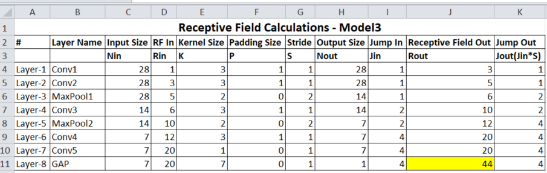
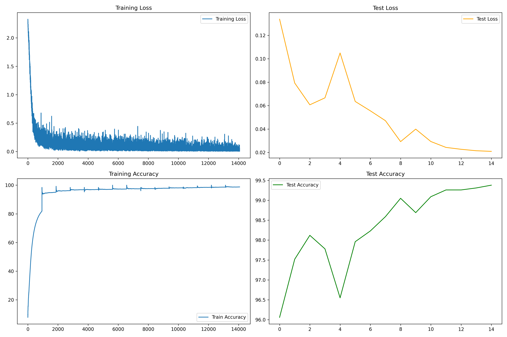

# Model Comparison Summary

| **Model** | **Target** | **Results** |  |  | **Analysis** | **Logs** |
|-----------|------------|-------------|----|----|--------------|------------------|
|           |            | **Parameters** | **Best Training Accuracy** | **Best Testing Accuracy** |              |                  |
| **Model 1** | 1. Skeleton code, 15 epochs <br> 2. Stable model (no overfitting) | **18,422** | **99.28%** | **99.16%** | 1. Consistently improving learning <br> 2. Accuracy > 99% <br> 3. Can reduce params to ~8K | [Logs-Model1](./Logs-Model1.log)  |
| **Model 2** | 1. Reduce params to ~8K <br> 2. Remove FC <br> 3. Use GAP <br> 4. Optimizer → SGD | **8,682** | **99.55%** | **98.70%** | 1. Slight overfitting <br> 2. Test accuracy dropped <99% <br> 3. Needs tuning to hit 99.4% | [Logs-Model2](./Logs-Model2.log) |
| **Model 3** | 1. Improve accuracy <br> 2. Use OneCycleLR <br> 3. Add more transforms (RandomAffine etc.) | **8,054** | **98.53%** | **99.13%** | 1. Params reduced from 8682 → 8054 <br> 2. **Performance improved greatly. Model able to touch 99.39% test accuracy** <br> 3. Last 4 epochs consistently >99.26% <br> Learnt about OneCycleLR and its usage with SGD. | [Logs-Model3](./Logs-Model3.log) |


# Model-3


## Receptive Field Calculations



[RF-Calculations.xlsx](RF-Calculations.xlsx)

## Model-3 Performance


## Detailed Logs
```
(.venv) PS C:\Raghu\MyLearnings\ERA_V4\S6-21092025\code\mnist_digits_experiments> python Experiment3.py
CUDA Available? True
cuda
----------------------------------------------------------------
        Layer (type)               Output Shape         Param #
================================================================
            Conv2d-1            [-1, 8, 28, 28]              80
       BatchNorm2d-2            [-1, 8, 28, 28]              16
            Conv2d-3           [-1, 16, 28, 28]           1,168
       BatchNorm2d-4           [-1, 16, 28, 28]              32
         MaxPool2d-5           [-1, 16, 14, 14]               0
            Conv2d-6           [-1, 16, 14, 14]           2,320
       BatchNorm2d-7           [-1, 16, 14, 14]              32
         MaxPool2d-8             [-1, 16, 7, 7]               0
            Conv2d-9             [-1, 28, 7, 7]           4,060
      BatchNorm2d-10             [-1, 28, 7, 7]              56
           Conv2d-11             [-1, 10, 7, 7]             290
AdaptiveAvgPool2d-12             [-1, 10, 1, 1]               0
================================================================
Total params: 8,054
Trainable params: 8,054
Non-trainable params: 0
----------------------------------------------------------------
Input size (MB): 0.00
Forward/backward pass size (MB): 0.39
Params size (MB): 0.03
Estimated Total Size (MB): 0.42
----------------------------------------------------------------
EPOCH: 1
28092025-2126
Epoch 1 Loss=0.2574 Batch_id=937 Accuracy=81.91: 100%|██████████████████████████████████████████████████████████████████████████████████████████████████████████████████████████████████| 938/938 [00:53<00:00, 17.68it/s]
28092025-2127

Test set: Average loss: 0.1338, Accuracy: 9606/10000 (96.06%)

-----------------------------------------------
EPOCH: 2
28092025-2127
Epoch 2 Loss=0.1229 Batch_id=937 Accuracy=95.09: 100%|██████████████████████████████████████████████████████████████████████████████████████████████████████████████████████████████████| 938/938 [00:59<00:00, 15.79it/s] 
28092025-2128

Test set: Average loss: 0.0793, Accuracy: 9752/10000 (97.52%)

-----------------------------------------------
EPOCH: 3
28092025-2128
Epoch 3 Loss=0.2285 Batch_id=937 Accuracy=96.20: 100%|██████████████████████████████████████████████████████████████████████████████████████████████████████████████████████████████████| 938/938 [01:02<00:00, 14.91it/s] 
28092025-2129

Test set: Average loss: 0.0607, Accuracy: 9812/10000 (98.12%)

-----------------------------------------------
EPOCH: 4
28092025-2129
Epoch 4 Loss=0.0736 Batch_id=937 Accuracy=96.83: 100%|██████████████████████████████████████████████████████████████████████████████████████████████████████████████████████████████████| 938/938 [01:07<00:00, 13.82it/s] 
28092025-2130

Test set: Average loss: 0.0666, Accuracy: 9778/10000 (97.78%)

-----------------------------------------------
EPOCH: 5
28092025-2130
Epoch 5 Loss=0.2275 Batch_id=937 Accuracy=96.99: 100%|██████████████████████████████████████████████████████████████████████████████████████████████████████████████████████████████████| 938/938 [01:07<00:00, 13.86it/s] 
28092025-2132

Test set: Average loss: 0.1050, Accuracy: 9655/10000 (96.55%)

-----------------------------------------------
EPOCH: 6
28092025-2132
Epoch 6 Loss=0.0287 Batch_id=937 Accuracy=97.11: 100%|██████████████████████████████████████████████████████████████████████████████████████████████████████████████████████████████████| 938/938 [01:09<00:00, 13.53it/s] 
28092025-2133

Test set: Average loss: 0.0636, Accuracy: 9796/10000 (97.96%)

-----------------------------------------------
EPOCH: 7
28092025-2133
Epoch 7 Loss=0.0107 Batch_id=937 Accuracy=97.33: 100%|██████████████████████████████████████████████████████████████████████████████████████████████████████████████████████████████████| 938/938 [01:09<00:00, 13.44it/s] 
28092025-2134

Test set: Average loss: 0.0555, Accuracy: 9823/10000 (98.23%)

-----------------------------------------------
EPOCH: 8
28092025-2134
Epoch 8 Loss=0.2168 Batch_id=937 Accuracy=97.48: 100%|██████████████████████████████████████████████████████████████████████████████████████████████████████████████████████████████████| 938/938 [01:06<00:00, 14.05it/s] 
28092025-2135

Test set: Average loss: 0.0471, Accuracy: 9859/10000 (98.59%)

-----------------------------------------------
EPOCH: 9
28092025-2135
Epoch 9 Loss=0.0603 Batch_id=937 Accuracy=97.63: 100%|██████████████████████████████████████████████████████████████████████████████████████████████████████████████████████████████████| 938/938 [01:07<00:00, 13.88it/s] 
28092025-2136

Test set: Average loss: 0.0292, Accuracy: 9905/10000 (99.05%)

-----------------------------------------------
EPOCH: 10
28092025-2137
Epoch 10 Loss=0.0080 Batch_id=937 Accuracy=97.84: 100%|█████████████████████████████████████████████████████████████████████████████████████████████████████████████████████████████████| 938/938 [01:10<00:00, 13.23it/s] 
28092025-2138

Test set: Average loss: 0.0399, Accuracy: 9869/10000 (98.69%)

-----------------------------------------------
EPOCH: 11
28092025-2138
Epoch 11 Loss=0.0658 Batch_id=937 Accuracy=98.16: 100%|█████████████████████████████████████████████████████████████████████████████████████████████████████████████████████████████████| 938/938 [01:07<00:00, 13.88it/s] 
28092025-2139

Test set: Average loss: 0.0293, Accuracy: 9909/10000 (99.09%)

-----------------------------------------------
EPOCH: 12
28092025-2139
Epoch 12 Loss=0.0154 Batch_id=937 Accuracy=98.27: 100%|█████████████████████████████████████████████████████████████████████████████████████████████████████████████████████████████████| 938/938 [01:09<00:00, 13.47it/s] 
28092025-2140

Test set: Average loss: 0.0243, Accuracy: 9926/10000 (99.26%)

-----------------------------------------------
EPOCH: 13
28092025-2140
Epoch 13 Loss=0.0801 Batch_id=937 Accuracy=98.50: 100%|█████████████████████████████████████████████████████████████████████████████████████████████████████████████████████████████████| 938/938 [01:08<00:00, 13.71it/s] 
28092025-2141

Test set: Average loss: 0.0227, Accuracy: 9926/10000 (99.26%)

-----------------------------------------------
EPOCH: 14
28092025-2142
Epoch 14 Loss=0.0195 Batch_id=937 Accuracy=98.64: 100%|█████████████████████████████████████████████████████████████████████████████████████████████████████████████████████████████████| 938/938 [01:11<00:00, 13.05it/s] 
28092025-2143

Test set: Average loss: 0.0215, Accuracy: 9931/10000 (99.31%)

-----------------------------------------------
EPOCH: 15
28092025-2143
Epoch 15 Loss=0.0061 Batch_id=937 Accuracy=98.76: 100%|█████████████████████████████████████████████████████████████████████████████████████████████████████████████████████████████████| 938/938 [01:11<00:00, 13.09it/s] 
28092025-2144

Test set: Average loss: 0.0209, Accuracy: 9938/10000 (99.38%)

-----------------------------------------------
Plot saved as training_results-28092025-2144.png
(.venv) PS C:\Raghu\MyLearnings\ERA_V4\S6-21092025\code\mnist_digits_experiments>
```